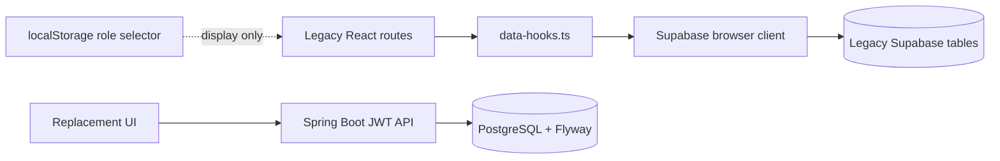

# Code Index and Migration Baseline

**Inspected:** 25 July 2026
**Target architecture:** [ADR-010](ADR-010-JAVA-POSTGRES.md) and [architecture override](../../requirements/22_JAVA_POSTGRES_ARCHITECTURE_OVERRIDE.md)

## Baseline identity

| Item | Recorded value |
|---|---|
| Current baseline commit | `5e463c75669ecf98febcfa7a58b63bcadd0d2d5d` (`5e463c7`) |
| Rollback tag | `baseline/pre-workforce-20260725` → `d886aa5a8864a188b54ba1f0aac87cc87ee35921` |
| Historical database migration | `supabase/migrations/20260509073727_a3ac9a00-fe4c-49cd-8422-811480f9010d.sql` at the baseline tag only |
| Historical migration SHA-256 | `23168092d1ab178f20d2842b2cc8adb8c3ec9552df221a54bfebbd5def95b70b` |
| Historical local project id | `ftztndjcfcwqcvcdfvcq` was recorded in baseline `supabase/config.toml`; environment/purpose unverified |

The tag dereferences to an annotated-tag object; the recorded commit is the historical baseline application commit. Supabase/Lovable dependencies and migration files are removed from the working tree; confirm a staging target before treating the historical project id as a deployable environment.

## Historical prototype map (legacy only)

| Area | Files | Current responsibility | Future disposition |
|---|---|---|---|
| App shell | `src/routes/__root.tsx`, `src/components/app-sidebar.tsx`, `src/components/role-switcher.tsx` | Sidebar, global query client, role dropdown, error/404 shell | Replace with authenticated scope-aware shell; demo selector never authorizes |
| Dashboard | `src/routes/index.tsx` | Aggregates five legacy tables | Replace with role-aware backend dashboard |
| Engagements | `src/routes/engagements.tsx` | Reads engagements/requirements | Preserve URL behind legacy flag or redirect to admin engagements |
| Requirements | `src/routes/requirements.tsx` | Reads legacy tables and inserts `requirements` directly from browser | Freeze as legacy; never equate a requirement with a canonical deliverable |
| Scope | `src/routes/scope.tsx` | Client-side fixed-cost capacity calculation | Legacy-only, feature-flagged |
| Approvals | `src/routes/approvals.tsx` | Direct browser status update | Replace with scoped approval service/action audit |
| UAT | `src/routes/uat.tsx` | Reads UAT items | Legacy-only; not delivery certification |
| Invoices | `src/routes/invoices.tsx` | Reads invoice rows | Replace with evidence/readiness/procurement workflow |
| Data access | `src/lib/data-hooks.ts`, `src/integrations/supabase/*` | React Query plus direct Supabase reads/mutations | Do not reuse for new domains; use typed secured HTTP/OpenAPI client |
| Runtime | `src/server.ts`, `src/start.ts`, `src/router.tsx` | TanStack Start SSR/error handling | Legacy runtime only; production backend moves to Spring Boot |

## Historical legacy data model

The historical sole migration creates `engagements`, `requirements`, `approvals`, `uat_items`, and `invoices`. `requirements` and `invoices` reference `engagements`; `approvals` and `uat_items` reference `requirements`. It enabled RLS **and granted `anon all` to every table**. It is preserved in the baseline history only and is not acceptable tenant isolation.

## Historical dependencies and data-access risks

- The dashboard and legacy routes depend on one shared `data-hooks.ts` file; no domain/service boundary exists.
- `requirements.tsx` inserts directly into the legacy database and `approvals.tsx` updates approval status directly. Neither operation provides production authorization, idempotency, audit provenance, or evidence locking.
- `role-store.ts` is module state/localStorage and is explicitly not RBAC. `auth-middleware.ts` exists but is not wired as a route boundary.
- `client.server.ts` supports a service role; it must never enter any client bundle. New Java services must replace this privileged path.
- Current routes and the generated `routeTree.gen.ts` remain baseline artifacts. Do not manually edit generated code.

## Current working-tree index

| Layer | Primary files | Responsibility |
|---|---|---|
| Frontend entry/runtime | `index.html`, `src/main.tsx`, `src/router.tsx`, `vite.config.ts` | Standard Vite React SPA and generated TanStack file routes |
| Frontend API/auth | `src/lib/api-client.ts`, `src/lib/auth/*`, `src/features/auth/session-provider.tsx` | Typed `/api/v1` calls, session resolution, safe redirect handling |
| Frontend compatibility | `src/lib/data-hooks.ts`, `src/routes/{engagements,requirements,scope,approvals,uat,invoices}.tsx` | Read-only legacy views behind feature flag |
| Java bootstrap/config | `backend/pom.xml`, `backend/src/main/java/com/vms/workflow/VmsWorkflowApplication.java`, `backend/src/main/resources/application*.yml` | Spring Boot 4.1 application and external configuration |
| Java API/services | `backend/src/main/java/com/vms/workflow/{api,application,security}` | JWT security, tenant/permission checks, RFC 7807, core and compatibility APIs |
| Persistence | `backend/src/main/java/com/vms/workflow/{domain,infrastructure}` | JPA entities/repositories and fixed-allowlist legacy JDBC reads |
| Database | `backend/src/main/resources/db/migration` | Flyway schema, constraints, role/permission templates and required masters |
| Integration tests | `backend/src/test` | Flyway/Testcontainers PostgreSQL HTTP security and constraint tests |
| SDLC evidence | `sdlc/`, `scripts/sdlc-harness.mjs`, `docs/features/` | Model-separated task/test/codegen/review/fix/documentation gates |

No current source or dependency manifest imports Lovable, Supabase, Cloudflare, or TanStack Start server packages. Historical references remain only in requirements, architecture/audit documentation and Git history.

## Environment and flags

The replacement `.env.example`, `src/lib/env.ts`, and `src/lib/feature-flags.ts` retain only public API/login paths, safe demo presentation and rollout flags. They do not contain provider or database secrets and never govern Java authorization. Java database/JWT configuration is server-side under `backend/src/main/resources`; production must fail closed when required values are absent.

## Migration boundary

New Java work starts at `backend/` with `backend/pom.xml`, Spring Boot 4.1.0, Flyway, springdoc 3.0.3, and PostgreSQL. The standard Vite React/TanStack frontend remains at repository-root `src/`. Treat legacy records as a separately mapped source. Do not run destructive migration, rename `requirements` to `deliverables`, or import personal data until source export, mapping, reconciliation, and staging rehearsal are approved.
