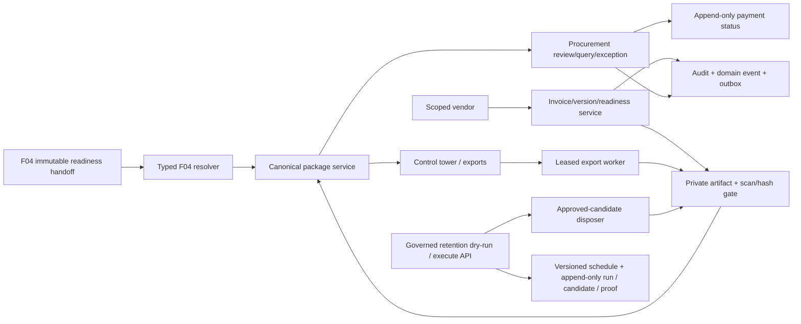

# F05 — Architecture

## Design rules

- F04 facts are consumed by a typed adapter only; F05 cannot approve/recompute
  attendance, plan, certification or confirmation.
- Canonical manifests use deterministic JSON and SHA-256. Outputs have their
  own byte hashes; supersession creates new lineage rather than mutation.
- All sensitive actions derive identity/scope/authority server-side and run in
  transactional service boundaries with audit/outbox/idempotency facts.
- Private artifacts are scan/hash authorized before package/export/download.
  Local provider adapters are intentionally not production acceptance.
- V45 retention removes only explicitly dry-run-approved, due,
  unreferenced/unheld local PostgreSQL bytes. It reuses the organization-scoped
  F07 versioned schedule and execution model and seeds no duration. Immutable
  metadata, hashes and lineage remain. Transactional deletion
  is an explicit storage-adapter capability; external object stores require a
  durable pending/delete/retry/finalize implementation rather than pretending
  a remote delete rolls back with PostgreSQL.
- Package/readiness execute synchronously under version, idempotency and row
  locks. Export is a background worker; content retention requires explicit
  governed dry-run and execution. Notification
  delivery is an outbox integration contract, not a locally delivered fact.
- React/TanStack is a typed consumer. It stores no provider credential or
  signed URL and preserves opaque server pagination.
- Finance list pagination is database keyset based. Its HMAC cursor binds the
  actor, exact route, authorized engagement set, TTL, membership cutoff and
  final immutable sort tuple. The cutoff excludes later inserts, while mutable
  projections are deliberately labeled `LIVE_AT_READ`; no value-level
  historical snapshot is implied.

Implementation detail is in [CODEGEN.md](CODEGEN.md); operational response is
in [RUNBOOK.md](RUNBOOK.md).
