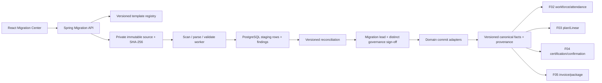

# F06 — Historical Migration Architecture

F06 is a server-authorized Java/PostgreSQL vertical. The browser never parses
governed CSV into canonical data and never talks to a database or storage
provider.

V17 stores immutable source metadata/bytes, jobs, rows, findings, dependencies,
decisions, checkpoints, reconciliation/sign-offs, canonical provenance,
attendance authority, rollback actions, retro requests, audit and outbox facts.
Represented historical time and actual recorded time are separate columns.
V18 adds append-only validation/reprocess hardening; V19 adds ordered
bounded-context effects and append-only compensation records; V20 makes the
upload-time partial-commit policy immutable and binds compensation sessions to
an exact governed rollback action.

The registry is the only accepted template contract. It covers the 14 physical
CSV files and their exact v1 headers, natural keys and dependency waves.
Dry-run creates no canonical facts. Commit is version checked, idempotent and
bound to the exact reconciliation hash plus two distinct authorities.
Duplicate classification and the active canonical-key lock happen before a
domain adapter runs. Rollback compensates eligible effects in reverse order
and records the compensation link without erasing the source/job history.

Raw punches and daily summaries share an authority record per employee/date;
they cannot contribute additive duration. Current Linear state is never
relabeled historical month-end without historical source evidence. Committed
facts consumed downstream cannot be hard deleted; correction uses reopen and
new versions.

Production source owners, storage/scanner configuration, masked rehearsal,
backup/restore checkpoint and final migration sign-off remain G4 external
acceptance.
