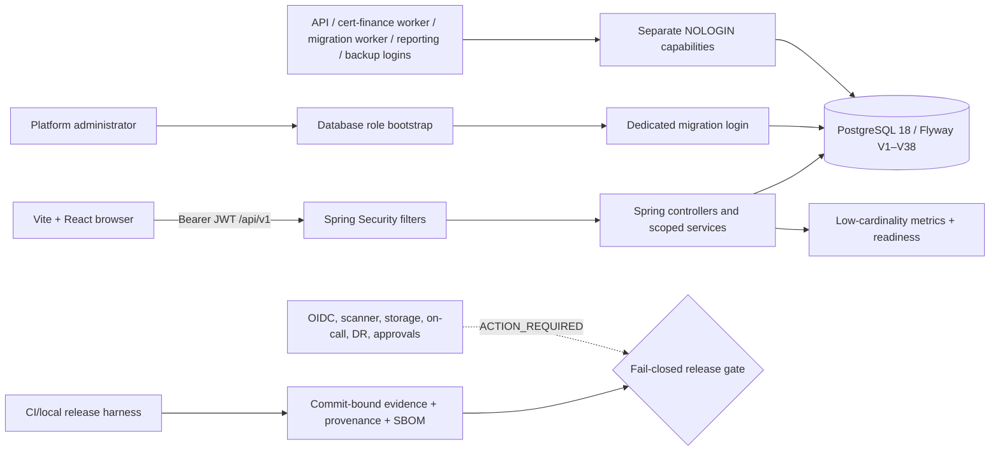

# F07 — Hardening and Go-live Architecture

## Trust boundaries

1. The browser is untrusted for roles, scope, actor, feature flags and legal
   hold state. It renders server responses and supplies validated commands.
2. Spring Security validates issuer/audience/signature, applies exact CORS and
   rate limits, and derives authorization from active PostgreSQL assignments.
3. Business services recheck object scope at execution time and append audit,
   lineage and idempotency facts transactionally.
4. PostgreSQL enforces immutable/append-only facts, prohibited field names,
   legal-hold release routing and least-privilege grants.
5. Deployment evidence is accepted only when structured results, artifacts and
   clean source provenance bind to the same commit.

## Database roles

| Capability | Intended use | Explicit boundary |
|---|---|---|
| `vms_migration_owner` | NOLOGIN owner for Flyway-managed objects | Application/worker cannot assume it. |
| `vms_app_runtime` | API business reads/writes | No DDL, Flyway history, migration role or audit mutation. |
| `vms_reporting` | Safe allowlisted reporting view | No blanket table, secret, binary, security-event or restricted payload access. |
| `vms_job_worker` | Certification notification/schedule/handoff and finance export/outbox queues | No HTTP, DDL, Flyway, identity/RBAC, provider-secret, migration-source or private-blob reads. |
| `vms_migration_processor` | Expired-lease migration scan/validation recovery | No HTTP, commit/rollback grants, identity/RBAC/provider-secret reads or direct source-blob access. Source bytes require its random live job lease through one fixed-path function. |
| `vms_backup` | Controlled read-only backup | No writes; separately provisioned and audited externally. |

Login roles and credentials are provisioned externally. V21 transfers owned
objects during a quiesced controlled migration and fails quickly on lock
contention. Forward migrations own and grant new objects explicitly.

The production migration chain is V1–V38. V28 introduces delivery commitment
transport, V29 the Linear reconciliation command ledger, V30 greytHR provider
attestation authority, V31 lineage/proxy hardening, V32 delivery-worker least
privilege, V33 the employee-policy command tenant gate, and V34–V38 the
governed identity, workforce, replay, roster, delegation and Linear-cursor
completion schema. V1000+ migrations exist only as test fixtures and are not
part of the production schema.

The machine-checked [traceability matrix](traceability-matrix.json) assigns
every F07 task and test a differentiated requirement/PRD mapping plus explicit
schema, API, UI, runbook and rollback impact. A catalog item cannot silently
inherit all three F07 requirements.

Both traceability and independent-review evidence are typed, versioned
contracts. Review evidence binds a real Git commit object that must be an
ancestor of the release under validation. Every review dimension has a
structured local closure disposition linked to its exact review and issue
documents. Runbook references must resolve to explicit anchors, not merely to
an existing Markdown file.

API deployments leave every `vms.*.worker-enabled` switch false. The three
worker profiles are non-web, disable Flyway, enable exactly one scheduler and
fail startup unless the login has exactly its expected capability and no other
runtime capability. Reference deployments are in
`backend/deploy/f07-workers.yaml`.

## Retention model

Schedules are immutable versions selected by organization, record class and
effective time. A dry run snapshots candidates and their source hash. Execution
serializes the run, rechecks hold/state, records per-candidate results in
independent transactions and preserves immutable closed evidence. Failures
transition through bounded retry to dead letter; recovery requires an explicit
authorized fact.

Legal holds are append-only transitions. Two-person release requires a
different actor, and a database trigger prevents direct legacy release.

## Feature-flag model

Definitions have safe defaults. Versions add SYSTEM, ORGANIZATION or ENGAGEMENT
scope, time windows and dependencies. The most specific effective scope wins;
unsatisfied dependency disables the flag. Evaluation is audited/scoped but
never returns authorization.

## Operations model

The release harness separates:

- schema validation from actual test execution;
- local synthetic evidence from external approval;
- source checksums from live Flyway history;
- encrypted bytes from independently authenticated manifests;
- a candidate build from commit-bound artifact provenance.

A schema-valid manifest can still be `NO_GO_ACTION_REQUIRED`. No down migration
is used for rollback; flags/integrations are disabled, a compatible prior
artifact is restored and new facts are preserved/reconciled.

Current local evidence passes the 73-unit + 45-integration focused backend
gate, 73 + 2 capacity gate, 7/7 F07 system, 4/4 finance system, 6/6 migration
system and 274/274 browser matrix. The complete Maven run is
**GREEN** at 73 unit + 217 integration (290/290). The intermediate 215/217 R2
result was caused by shared test-database state; a dedicated delivery-worker IT
database passes in R3.
Production identity/provider/legal/deployment/soak/DR and human approval gates
remain external and keep the release `NO-GO`.

## Cross-links

- [API/Swagger](API_DOCUMENTATION.md)
- [UI/operator guide](UI_DOCUMENTATION.md)
- [backend controls](BACKEND_CONTROLS.md)
- [retention/privacy controls](RETENTION_PRIVACY_CONTROLS.md)
- [release/DR procedure](../../operations/F07-RELEASE-AND-DR.md)
- [runbook catalog](../../operations/F07-RUNBOOKS.md)
